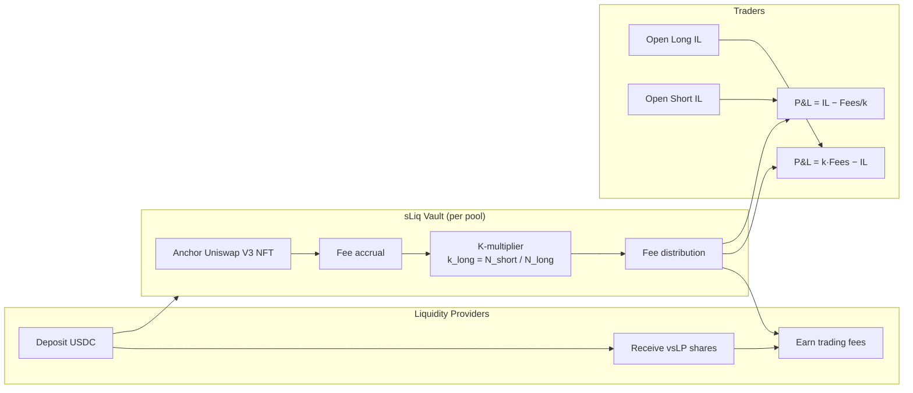
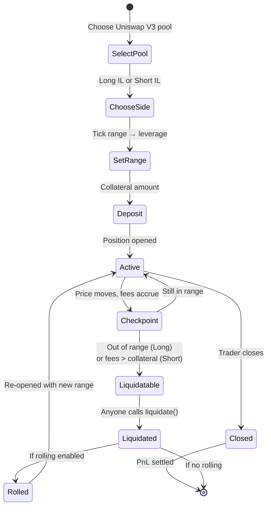
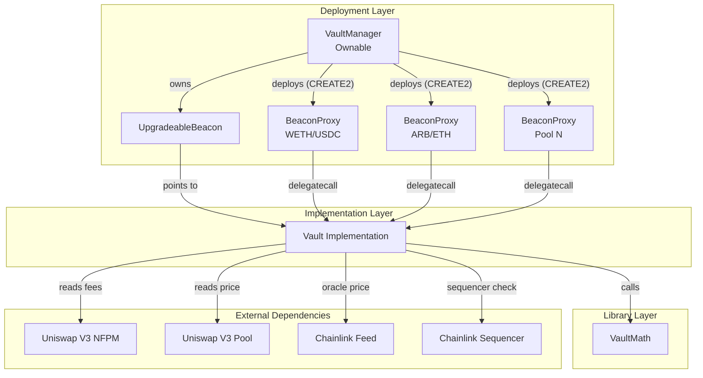

# sLiq Protocol

[](https://github.com/earn-park/sliq-protocol/actions/workflows/ci.yml)
[](https://getfoundry.sh)
[](./LICENSE)
[](https://soliditylang.org/)
[](https://arbitrum.io/)

**sLiq is the first tradable market for impermanent loss.** Traders take leveraged long or short positions on the IL of any Uniswap V3 pool, while liquidity providers earn fees from a self-balancing skew mechanism. Think of it as a volatility index (VIX) for DEX liquidity -- oracle-based, perpetual, chain-agnostic.

Built by [EarnPark](https://earnpark.com) | Live beta on [Arbitrum](https://sliq.finance) | [Whitepaper](https://sliq.finance)

> **Live metrics (30 days, organic):** 2,400+ positions opened, 175 ETH collateral deposited

---

## How It Works



1. **LPs deposit** collateral (e.g., USDC) into a Vault and receive `vsLP` shares. The vault holds an anchor Uniswap V3 NFT position that accrues trading fees.
2. **Traders open positions** by choosing a side (Long or Short IL), a tick range (determines leverage), and a collateral amount.
3. **Fees accrue continuously** from the anchor position. The **K-multiplier** distributes fees proportionally based on time-weighted skew between long and short effective liquidity.
4. **Settlement** occurs when traders close or get liquidated. Long positions earn `k·Fees − IL`, Short positions earn `IL − Fees/k`.

### Position Lifecycle



### K-Multiplier Mechanism

The K-multiplier is the core innovation that keeps the vault solvent without delta hedging:

- When **Long > Short** exposure: `k_long < 1`, `k_short > 1` -- longs earn less, shorts earn more
- When **Short > Long** exposure: `k_long > 1`, `k_short < 1` -- longs earn more, shorts earn less
- At **equilibrium**: `k = 1` for both sides

This creates a natural incentive for traders to take the underrepresented side, maintaining balance.

---

## Architecture

| Contract | Description | Size |
|----------|-------------|------|
| [`Vault.sol`](./src/Vault.sol) | Core vault: positions, checkpoints, deposits/withdrawals, ERC-4626-like share accounting | 22,168 B |
| [`VaultManager.sol`](./src/VaultManager.sol) | Beacon proxy factory: deploys and upgrades Vault instances per pool | 3,318 B |
| [`VaultMath.sol`](./src/VaultMath.sol) | Pure math library: IL calculation, effective liquidity, fee accounting, price conversions | 7,440 B |



### Key Features

- **Perpetual positions** -- no epoch locks, no expiry. Open and close at any time.
- **Leverage from range width** -- narrower tick ranges produce higher leverage (up to 1000x), derived from the IL formula.
- **Chainlink oracle primary** -- Chainlink price feeds with Arbitrum sequencer uptime checks; falls back to `pool.slot0()` only when Chainlink is unavailable.
- **Beacon proxy upgradeability** -- all vaults share a single implementation via `UpgradeableBeacon`, enabling atomic upgrades across all markets.
- **Auto-rolling positions** -- positions can be configured to automatically re-open on liquidation (direct, inverse-minus, or inverse-plus rolling strategies).
- **ERC-4626-like LP accounting** -- `vsLP` share tokens with proportional deposit/withdraw mechanics.

---

## Deployments

| Network | Contract | Address |
|---------|----------|---------|
| Arbitrum One | VaultManager | *Beta -- contact team* |
| Arbitrum One | VaultMath | *Beta -- contact team* |
| Arbitrum One | Vault (implementation) | *Beta -- contact team* |
| Arbitrum One | Vault (WETH/USDC proxy) | *Beta -- contact team* |

---

## Quick Start

```bash
git clone https://github.com/earn-park/sliq-protocol.git
cd sliq-protocol

forge install          # install dependencies
forge build            # compile contracts
forge test             # run all tests (131 unit + fuzz)
forge test --gas-report # with gas reporting
```

### Requirements

- [Foundry](https://book.getfoundry.sh/getting-started/installation) (forge, cast, anvil)
- Solidity 0.8.30+

### Configuration

Copy `.env.example` to `.env` and fill in your RPC URLs and API keys for fork testing and deployment.

---

## Testing

| Suite | Tests | Description |
|-------|-------|-------------|
| Unit: Vault | 61 | Deposit, withdraw, open, close, checkpoint, liquidate, rolling, pausable, guardian, invariants |
| Unit: VaultManager | 14 | Deploy, upgrade, access control, multi-vault |
| Unit: VaultMath | 40 | Price conversions, IL, fees, effective liquidity, triangular numbers |
| Fuzz: VaultMath | 16 | Property-based testing (1,000 runs each) -- roundtrips, monotonicity, bounds |

```bash
forge test -vvv                      # verbose output
forge coverage --ir-minimum          # coverage report
```

---

## Security

This codebase has undergone internal security review covering static analysis, economic attack modeling, and business logic audit. A formal third-party audit is planned prior to mainnet launch.

- **Security model:** [`docs/SECURITY.md`](./docs/SECURITY.md)
- **Vulnerability reporting:** See [`SECURITY.md`](./SECURITY.md)
- **Audit status:** Internal review completed; third-party audit planned

---

## Documentation

| Document | Description |
|----------|-------------|
| [ARCHITECTURE.md](./docs/ARCHITECTURE.md) | System design, contract relationships, Mermaid diagrams |
| [SECURITY.md](./docs/SECURITY.md) | Trust assumptions, known limitations, invariants |
| [MATH.md](./docs/MATH.md) | IL formulas, K-multiplier derivation, fee distribution math |
| [MARKET_ANALYSIS.md](./docs/MARKET_ANALYSIS.md) | Competitive landscape, market sizing, and design advantages |
| [DEPLOYMENT.md](./docs/DEPLOYMENT.md) | Deployment guide, Arbitrum addresses, upgrade procedures |
| [INTEGRATION.md](./docs/INTEGRATION.md) | Integration guide for external protocols and frontends |
| [ROADMAP.md](./docs/ROADMAP.md) | Development roadmap, grant milestones, planned features |
| [CHANGELOG.md](./CHANGELOG.md) | Release history (Common Changelog format) |

---

## Links

- **App:** [sliq.finance](https://sliq.finance)
- **EarnPark:** [earnpark.com](https://earnpark.com)
- **Proof of Reserves:** [earnpark.com/proof-of-reserves](https://earnpark.com/en/proof-of-reserves/)
- **Whitepaper:** available at [sliq.finance](https://sliq.finance)

---

## Contributing

Please see [`CONTRIBUTING.md`](./CONTRIBUTING.md) for guidelines.

## License

This project is licensed under the [Business Source License 1.1](./LICENSE) (BUSL-1.1).

## Disclaimer

This software is provided as-is, without warranty of any kind. sLiq is a technical protocol for trading impermanent loss exposure. It does not provide investment advice. Users are responsible for understanding the risks of decentralized finance, including but not limited to smart contract risk, oracle risk, and market risk. See the [whitepaper](https://sliq.finance) and [SECURITY.md](./docs/SECURITY.md) for detailed risk disclosures.
