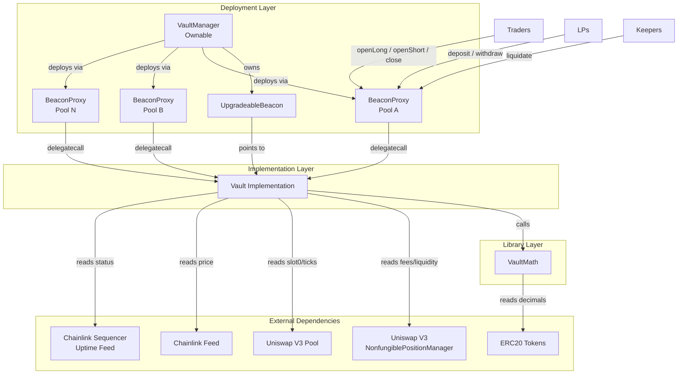
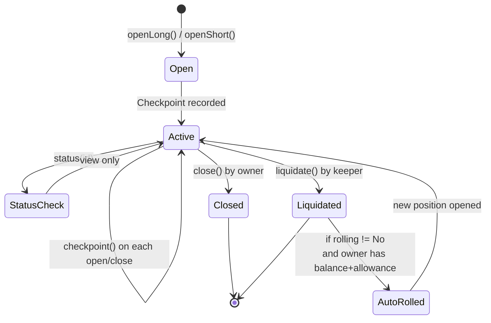

# Architecture

## System Overview

sLiq is a synthetic concentrated-liquidity protocol that creates a tradable market for impermanent loss (IL). The system comprises three contracts: a factory/manager, a shared math library, and per-pool vault proxies that hold anchor Uniswap V3 positions and manage trader/LP accounting.



## Contract Relationships

### VaultManager

`VaultManager` is the top-level admin contract. It is `Ownable` by the protocol deployer.

Responsibilities:
- Deploys new Vault proxies via `newVault()`, one per Uniswap V3 pool
- Owns the `UpgradeableBeacon`, enabling atomic implementation upgrades across all vaults
- Stores the current `VaultMath` address and can update it via `setVaultMath()`
- Maintains a `pool -> vault` registry to prevent duplicate deployments
- Uses CREATE2 with `keccak256(pool, anchorId)` as salt for deterministic proxy addresses

### Vault (BeaconProxy)

Each Vault is a `BeaconProxy` that delegates to the shared Vault implementation. State lives in the proxy; logic lives in the implementation.

Inheritance chain: `Initializable`, `ERC20Upgradeable`, `OwnableUpgradeable`, `ReentrancyGuardUpgradeable`.

Each vault holds:
- One anchor Uniswap V3 NFT position (via `anchorId`) that accrues trading fees
- Collateral deposits from LPs (ERC-4626-like share accounting via `vsLP` token)
- Collateral from open trader positions (tracked in `freezBalance`)
- A checkpoint array recording cumulative fees, skew values, and prices over time
- A position mapping tracking every open/closed trader position

### VaultMath

A stateless (except for `decimals()` reads) library contract used by all vaults. Contains:
- Fee calculation from Uniswap V3 fee growth accumulators
- IL percentage calculation from tick ranges
- Effective liquidity computation
- Price conversion utilities (sqrtPriceX96, tick, priceE18)
- Token denomination helpers (toE18, fromE18, sumTok0Tok1In0)

## Position Lifecycle



### Step-by-step

1. **Open**: Trader calls `openLong(range, amount, rolling)` or `openShort(range, amount, rolling)`.
   - Collateral is transferred from the trader to the vault.
   - `freezBalance` increases by the collateral amount.
   - Effective liquidity is calculated from collateral, range width, and anchor range.
   - `totalEffLong` or `totalEffShort` is incremented.
   - A new checkpoint is recorded.
   - Position struct is stored with `cpIndexOpen` pointing to the current checkpoint.

2. **Checkpoint**: Each open/close triggers `_checkpoint()`, which:
   - Reads cumulative fees from the Uniswap V3 pool's fee growth accumulators.
   - Computes delta fees in token0 terms (using the current price to convert token1).
   - Calculates time-weighted skew values for both sides.
   - Records `(timestamp, totalFeeCum, skewShortCum, skewLongCum, sqrtPX96, anchorCollateral)`.

3. **Status**: `status(id)` computes a position's current PnL without modifying state:
   - Creates a virtual checkpoint at the current block.
   - Calculates IL based on how far the current price has moved from the position's midpoint.
   - Calculates fee share based on effective liquidity relative to anchor collateral.
   - Applies the K-multiplier (time-weighted average skew) to scale fees (for Longs) or IL (for Shorts).
   - Returns `result = collateral + fee - IL` (Long) or `result = collateral - fee + IL` (Short).

4. **Close**: Position owner calls `close(id)`.
   - PnL is settled. If positive, collateral token is transferred to the owner.
   - Protocol fee (percentage of the fee/IL income for the respective side) is sent to the vault owner.
   - Effective liquidity totals are decremented.
   - Position is marked inactive.

5. **Liquidate**: Any address can call `liquidate(id)` when:
   - Price has moved outside the position's tick range (`tick <= tickLower` or `tick >= tickUpper`), OR
   - For Short positions, accumulated fees exceed collateral.
   - The liquidator receives a fixed bounty (`bountyLiquidatorE18`).
   - If the position has rolling enabled and the owner has sufficient balance and allowance, a new position is automatically opened with the same parameters.

## Oracle Design

The oracle system uses a two-tier approach with safety checks.

### Primary: Chainlink

```
currentTick() logic:
1. Read Arbitrum sequencer uptime feed (seq)
2. If sequencer is UP (status == 0) AND has been up for > 1 hour:
   a. Read Chainlink price feed (feed)
   b. Validate: answer > 0, updatedAt != 0, answeredInRound >= roundId
   c. Normalize answer to 1e18
   d. Convert priceE18 to Uniswap tick via VaultMath.priceE18ToTick()
3. Use this tick for all position calculations
```

### Fallback: pool.slot0()

If any Chainlink check fails (sequencer down, stale data, zero answer), the system falls back to `pool.slot0()`, which reads the last traded price directly from the Uniswap V3 pool.

### Safety Properties

- **Sequencer grace period**: 1-hour cooldown after sequencer comes back up prevents stale-price exploitation during L2 outages.
- **Staleness checks**: `answeredInRound >= roundId` and `updatedAt != 0` reject stale or incomplete rounds.
- **Sign check**: `answer > 0` rejects invalid negative prices.
- **Decimal normalization**: Handles any feed decimal precision (6, 8, 18, etc.) correctly.

## Vault Economics

### LP Deposits and Withdrawals

The vault uses ERC-4626-style share accounting via the `vsLP` token.

**Deposit**:
- First depositor: 1:1 ratio (shares = amount).
- Subsequent depositors: `shares = amount * totalSupply / unfrozenAssets`.
- Floor guarantee: `shares >= amount` (prevents dilution attacks on early deposits).
- `unfrozenAssets = totalBalance - freezBalance` (position collateral is excluded from the share denominator).

**Withdraw**:
- `amount = shares * unfrozenAssets / totalSupply`.
- Requires `unfrozenAssets >= totalSupply` (liquidity check).
- Burns shares, transfers collateral.

### Fee Flow

1. The anchor Uniswap V3 position earns trading fees from swap activity in the pool.
2. On each checkpoint, delta fees are recorded cumulatively.
3. When a position closes, its share of fees is calculated as:
   - `feeShare = effLiquidity / anchorCollateral` (at open time).
   - `rawFee = deltaFeeCum * feeShare / 1.3` (the 1.3x divisor creates a buffer).
4. For Long positions: fees are scaled by the K-multiplier before being credited.
5. For Short positions: fees are charged at the raw rate, paid from collateral.
6. Fee splits: `feeVaultPercentE2` (default 3%) to the vault, `feeProtocolPercentE2` (default 2%) to the protocol owner. The remaining 95% is distributed to positions.

## Skew Mechanism (K-Multiplier)

The K-multiplier is the core mechanism that keeps the vault balanced without external hedging. See [MATH.md](./MATH.md) for the full derivation.

**Principle**: When one side (Long or Short) is overrepresented, its payoff is discounted and the underrepresented side's payoff is boosted. This creates a natural incentive to take the underrepresented side.

**Computation**:
- `skewShort = 2 * totalEffLong / (totalEffLong + totalEffShort)`
- `skewLong = 2 * totalEffShort / (totalEffLong + totalEffShort)`
- Both are scaled by `(10000 - feeVaultPercent - feeProtocolPercent) / 10000`.
- The skew is time-weighted: checkpoints accumulate `skew * deltaTime`, and the effective K for a position is the time-weighted average over its lifetime.

**Effect**:
- When Longs == Shorts: K = 1.0 for both sides (balanced).
- When Longs > Shorts: K_long < 1.0 (Longs earn less fee), K_short > 1.0 (Shorts earn more IL).
- When Shorts > Longs: K_short < 1.0 (Shorts earn less IL), K_long > 1.0 (Longs earn more fee).

## Upgradeability

The system uses OpenZeppelin's Beacon Proxy pattern.

```
VaultManager (owner)
  |
  v
UpgradeableBeacon (stores implementation address)
  |
  +--> BeaconProxy (Pool A) --delegatecall--> Vault Implementation v1
  +--> BeaconProxy (Pool B) --delegatecall--> Vault Implementation v1
  +--> BeaconProxy (Pool N) --delegatecall--> Vault Implementation v1
```

- **Upgrade path**: `VaultManager.upgradeVaultImpl(newImpl)` calls `beacon.upgradeTo(newImpl)`, which atomically switches the implementation for all proxies.
- **Storage compatibility**: New implementations must preserve the existing storage layout. New state variables can only be appended.
- **VaultMath upgrade**: `VaultManager.setVaultMath(newMath)` updates the math library address. Note: this only affects newly deployed vaults; existing vaults retain their original VaultMath reference unless individually updated.

## Trust Assumptions

| Actor | Trust Level | Capabilities |
|-------|-------------|-------------|
| VaultManager owner | High | Can upgrade all vault implementations, deploy new vaults, change VaultMath |
| Vault owner | High | Can set fee parameters (vault %, protocol %, liquidator bounty), receives protocol fees |
| Traders | Untrusted | Can open/close own positions, must approve collateral |
| LPs | Untrusted | Can deposit/withdraw (subject to liquidity checks) |
| Liquidators | Untrusted | Can liquidate positions that meet liquidation criteria |
| Chainlink | Moderate | Oracle price accuracy; fallback to pool.slot0() if unavailable |
| Uniswap V3 | Moderate | Pool fee accrual, price data (fallback oracle), NFT position management |

The protocol owner (VaultManager owner) has significant control: they can upgrade the Vault implementation to arbitrary code, which could in theory drain all funds. This is the standard trust model for upgradeable DeFi protocols. A timelock and multisig are recommended before mainnet launch.
