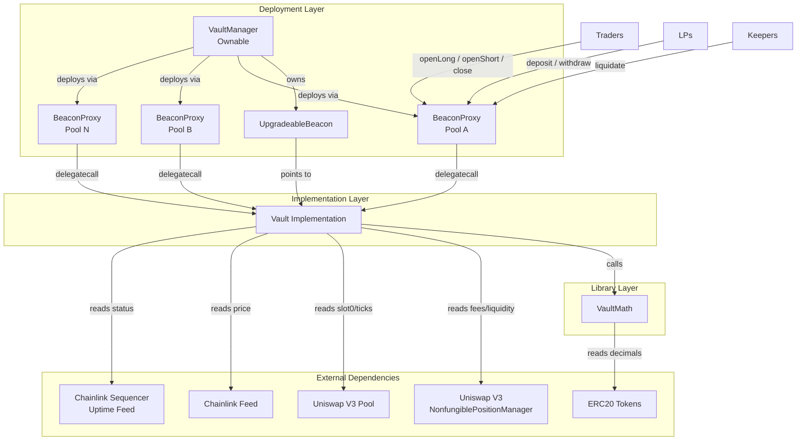
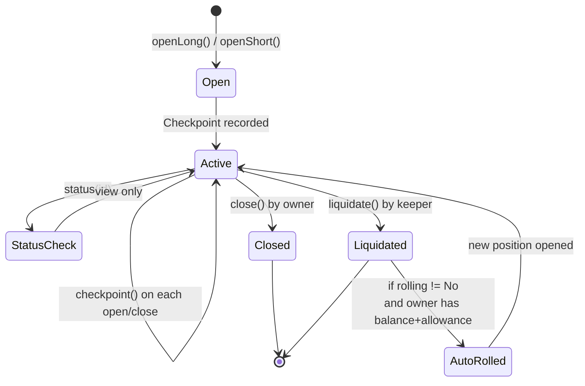
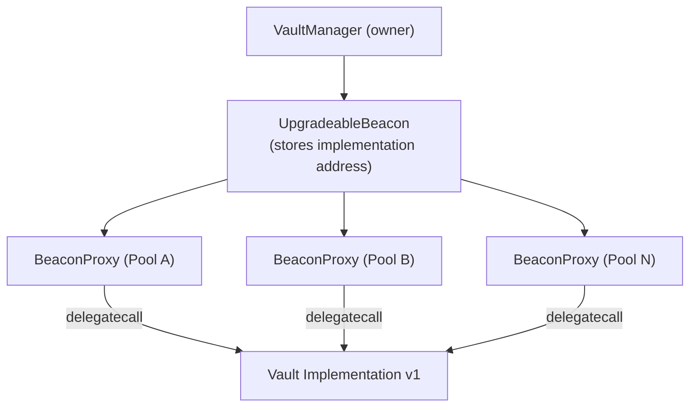
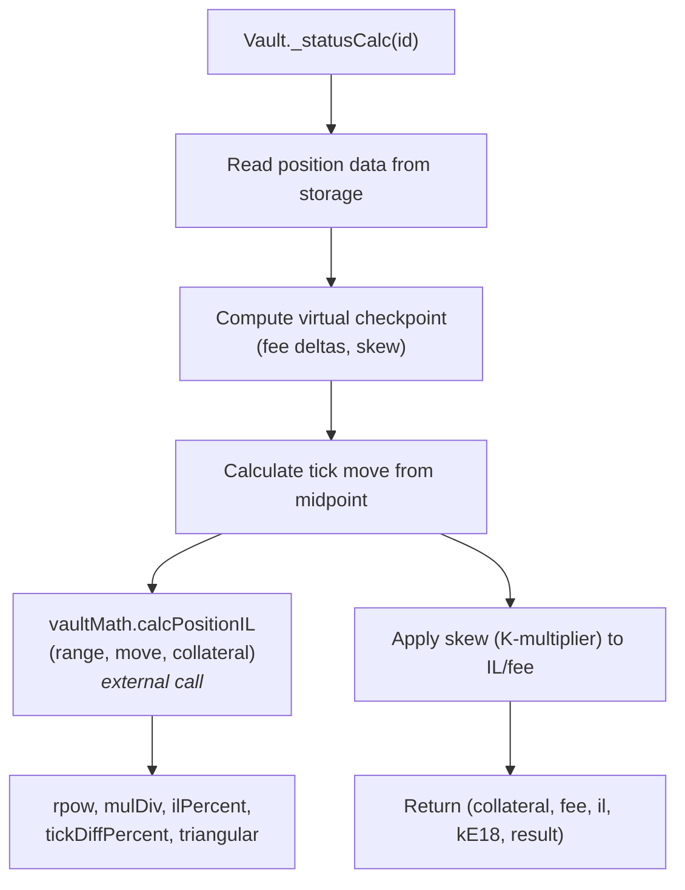

# Architecture

## System Overview

sLiq is a synthetic concentrated-liquidity protocol that creates a tradable market for impermanent loss (IL). The system comprises three contracts: a factory/manager, a shared math library, and per-pool vault proxies that hold anchor Uniswap V3 positions and manage trader/LP accounting.



## Contract Relationships

### VaultManager

`VaultManager` is the top-level admin contract. It is `Ownable` by the protocol deployer.

Responsibilities:
- Deploys new Vault proxies via `newVault()`, one per Uniswap V3 pool
- Owns the `UpgradeableBeacon`, enabling atomic implementation upgrades across all vaults
- Stores the current `VaultMath` address and can update it via `setVaultMath()`
- Maintains a `pool -> vault` registry to prevent duplicate deployments
- Uses CREATE2 with `keccak256(pool, anchorId)` as salt for deterministic proxy addresses

### Vault (BeaconProxy)

Each Vault is a `BeaconProxy` that delegates to the shared Vault implementation. State lives in the proxy; logic lives in the implementation.

Inheritance chain: `Initializable`, `ERC20Upgradeable`, `OwnableUpgradeable`, `ReentrancyGuardUpgradeable`.

Each vault holds:
- One anchor Uniswap V3 NFT position (via `anchorId`) that accrues trading fees
- Collateral deposits from LPs (ERC-4626-like share accounting via `vsLP` token)
- Collateral from open trader positions (tracked in `freezBalance`)
- A checkpoint array recording cumulative fees, skew values, and prices over time
- A position mapping tracking every open/closed trader position

### VaultMath

A stateless (except for `decimals()` reads) library contract used by all vaults. Contains:
- Fee calculation from Uniswap V3 fee growth accumulators
- IL percentage calculation from tick ranges
- Effective liquidity computation
- Price conversion utilities (sqrtPriceX96, tick, priceE18)
- Token denomination helpers (toE18, fromE18, sumTok0Tok1In0)

## Position Lifecycle



### Step-by-step

1. **Open**: Trader calls `openLong(range, amount, rolling)` or `openShort(range, amount, rolling)`.
   - Collateral is transferred from the trader to the vault.
   - `freezBalance` increases by the collateral amount.
   - Effective liquidity is calculated from collateral, range width, and anchor range.
   - `totalEffLong` or `totalEffShort` is incremented.
   - A new checkpoint is recorded.
   - Position struct is stored with `cpIndexOpen` pointing to the current checkpoint.

2. **Checkpoint**: Each open/close triggers `_checkpoint()`, which:
   - Reads cumulative fees from the Uniswap V3 pool's fee growth accumulators.
   - Computes delta fees in token0 terms (using the current price to convert token1).
   - Calculates time-weighted skew values for both sides.
   - Records `(timestamp, totalFeeCum, skewShortCum, skewLongCum, sqrtPX96, anchorCollateral)`.

3. **Status**: `status(id)` computes a position's current PnL without modifying state:
   - Creates a virtual checkpoint at the current block.
   - Calculates IL based on how far the current price has moved from the position's midpoint.
   - Calculates fee share based on effective liquidity relative to anchor collateral.
   - Applies the K-multiplier (time-weighted average skew) to scale fees (for Longs) or IL (for Shorts).
   - Returns `result = collateral + fee - IL` (Long) or `result = collateral - fee + IL` (Short).

4. **Close**: Position owner calls `close(id)`.
   - PnL is settled. If positive, collateral token is transferred to the owner.
   - Protocol fee (percentage of the fee/IL income for the respective side) is sent to the vault owner.
   - Effective liquidity totals are decremented.
   - Position is marked inactive.

5. **Liquidate**: Any address can call `liquidate(id)` when:
   - Price has moved outside the position's tick range (`tick <= tickLower` or `tick >= tickUpper`), OR
   - For Short positions, accumulated fees exceed collateral.
   - The liquidator receives a fixed bounty (`bountyLiquidatorE18`).
   - If the position has rolling enabled and the owner has sufficient balance and allowance, a new position is automatically opened with the same parameters.

## Oracle Design

The oracle system uses a two-tier approach with safety checks. The v1 implementation uses Chainlink as the primary oracle with `pool.slot0()` as a fallback. TWAP-based oracle integration is planned for v2 to provide a third tier of price validation.

### Primary: Chainlink

```
currentTick() logic:
1. Read Arbitrum sequencer uptime feed (seq)
2. If sequencer is UP (status == 0) AND has been up for > 1 hour:
   a. Read Chainlink price feed (feed)
   b. Validate: answer > 0, updatedAt != 0, answeredInRound >= roundId
   c. Normalize answer to 1e18
   d. Convert priceE18 to Uniswap tick via VaultMath.priceE18ToTick()
3. Use this tick for all position calculations
```

### Fallback: pool.slot0()

If any Chainlink check fails (sequencer down, stale data, zero answer), the system falls back to `pool.slot0()`, which reads the last traded price directly from the Uniswap V3 pool.

### Safety Properties

- **Sequencer grace period**: 1-hour cooldown after sequencer comes back up prevents stale-price exploitation during L2 outages.
- **Staleness checks**: `answeredInRound >= roundId`, `updatedAt != 0`, and `block.timestamp - updatedAt < STALENESS_THRESHOLD` (3600s) reject stale or incomplete rounds. Feed decimals are cached at initialization to avoid redundant external calls.
- **Sign check**: `answer > 0` rejects invalid negative prices.
- **Decimal normalization**: Handles any feed decimal precision (6, 8, 18, etc.) correctly.

## Vault Economics

### LP Deposits and Withdrawals

The vault uses ERC-4626-style share accounting via the `vsLP` token.

**Deposit**:
- First depositor: dead shares defense -- 1,000 shares are minted to `address(1)` to prevent share inflation attacks. The depositor receives `amount - DEAD_SHARES` shares.
- Subsequent depositors: `shares = amount * totalSupply / unfrozenAssets`.
- `unfrozenAssets = totalBalance - freezBalance` (position collateral is excluded from the share denominator).
- Fee-on-transfer tokens are detected via balance checks before and after transfer; mismatches revert with `TransferAmountMismatch`.

**Withdraw**:
- `amount = shares * unfrozenAssets / totalSupply`.
- Requires `unfrozenAssets >= totalSupply` (liquidity check).
- Burns shares, transfers collateral.

### Fee Flow

1. The anchor Uniswap V3 position earns trading fees from swap activity in the pool.
2. On each checkpoint, delta fees are recorded cumulatively.
3. When a position closes, its share of fees is calculated as:
   - `feeShare = effLiquidity / anchorCollateral` (at open time).
   - `rawFee = deltaFeeCum * feeShare / 1.3` (the 1.3x divisor creates a buffer).
4. For Long positions: fees are scaled by the K-multiplier before being credited.
5. For Short positions: fees are charged at the raw rate, paid from collateral.
6. Fee splits: `feeVaultPercentE2` (default 3%) to the vault, `feeProtocolPercentE2` (default 2%) to the protocol owner. The remaining 95% is distributed to positions.

### Fee Structure

The protocol applies a 5% total fee on the income component (fees for Longs, IL for Shorts) of each closed position. This 5% is split into two distinct layers with different economic roles:

| Layer | Parameter | Default | Recipient | Purpose |
|-------|-----------|---------|-----------|---------|
| **Vault fee** | `feeVaultPercentE2` | 300 (3%) | Vault balance | Stays in the vault, accruing to LP share holders as yield. Liquidators also receive bounties from this pool. |
| **Protocol fee** | `feeProtocolPercentE2` | 200 (2%) | `owner()` via `safeTransfer` | Transferred to the vault owner address on each position close (`Vault.sol:594`). Funds protocol operations. |

The protocol's take rate — the portion extracted from the system — is 2%. The remaining 3% stays within the vault ecosystem, benefiting LPs and incentivizing liquidators.

Both parameters are adjustable by the vault owner via `setFees()`, subject to an on-chain cap: `feeVaultPercentE2 + feeProtocolPercentE2 <= MAX_TOTAL_FEE_E2 (2000 = 20%)`.

Additionally, a 1.3x fee buffer (`FEE_BUFFER_E18 = 13e17`) is applied as a divisor to the raw fee share (`wFee = rawFee / 1.3`), ensuring the vault never over-distributes fees. This buffer means positions receive at most ~76.9% of their proportional fee entitlement; the remainder stays in the vault as an additional safety margin for LPs.

## Skew Mechanism (K-Multiplier)

The K-multiplier is the core mechanism that keeps the vault balanced without external hedging. See [MATH.md](./MATH.md) for the full derivation.

**Principle**: When one side (Long or Short) is overrepresented, its payoff is discounted and the underrepresented side's payoff is boosted. This creates a natural incentive to take the underrepresented side.

**Computation**:
- `skewShort = 2 * totalEffLong / (totalEffLong + totalEffShort)`
- `skewLong = 2 * totalEffShort / (totalEffLong + totalEffShort)`
- Both are scaled by `(10000 - feeVaultPercent - feeProtocolPercent) / 10000`.
- The skew is time-weighted: checkpoints accumulate `skew * deltaTime`, and the effective K for a position is the time-weighted average over its lifetime.

**Effect**:
- When Longs == Shorts: K = 1.0 for both sides (balanced).
- When Longs > Shorts: K_long < 1.0 (Longs earn less fee), K_short > 1.0 (Shorts earn more IL).
- When Shorts > Longs: K_short < 1.0 (Shorts earn less IL), K_long > 1.0 (Longs earn more fee).

### Skew Application by Side

The K-multiplier is applied asymmetrically to the two position sides. This is a deliberate design choice, not a uniform scaling:

| Side | Fee component | IL component | PnL formula |
|------|---------------|--------------|-------------|
| **Long** | `fee = wFee × K_long` (scaled) | `il = ilCalc` (raw, unscaled) | `collateral + fee − il` |
| **Short** | `fee = wFee` (raw, unscaled) | `il = ilCalc × K_short` (scaled) | `collateral − fee + il` |

When shorts are the minority side (`K_short > 1.0`), they earn **amplified IL returns** — the IL income is multiplied by the K-factor. However, the fee cost for shorts is always charged at the raw rate regardless of skew. Conversely, longs in the minority earn amplified fee income, while their IL cost is always raw.

This means:
- **Minority shorts** benefit from amplified IL payoff (not reduced fees).
- **Minority longs** benefit from amplified fee income (not reduced IL).

See [MATH.md Section 5](./MATH.md#5-fee-distribution) for the full derivation and implementation references.

### Dynamic Cost Mechanism

The effective cost of holding a position in sLiq is not a fixed protocol parameter — it emerges from the interaction of two dynamic components:

1. **Uniswap V3 anchor fees**: The anchor position accrues fees from organic swap activity in the underlying pool. During periods of high volatility, trading volume and fee generation increase naturally. These higher fees flow directly into position PnL calculations.

2. **K-multiplier amplification**: The skew mechanism amplifies or dampens the fee/IL components based on the long/short balance. When demand is skewed, the minority side receives boosted payoffs, creating higher effective yields during periods of market imbalance.

The combination produces a cost structure that responds to market conditions: in volatile markets with active trading, positions generate more fee income; when one side is in high demand, the opposite side becomes more attractive. Protocol fees (`feeVaultPercentE2`, `feeProtocolPercentE2`) are fixed by the vault owner and do not auto-adjust — only the Uniswap anchor fees and K-multiplier scaling are market-responsive.

## LP Model

### Deposit and Yield

LPs deposit collateral into a vault and receive `vsLP` ERC-20 share tokens representing their pro-rata claim on unfrozen vault assets. LP deposits are **side-agnostic** — there is no long or short selection for LPs. All LP capital is pooled together and backs the anchor Uniswap V3 position.

LP yield comes from two sources:
1. **Vault fee retention**: The 3% vault fee (`feeVaultPercentE2`) from closed positions remains in the vault, increasing the value of `vsLP` shares.
2. **Fee buffer surplus**: The 1.3x fee buffer means ~23% of proportional fee entitlements are retained in the vault.

### LP Flexibility

LPs interact with the vault through `deposit()` and `withdraw()` — neither function takes a side parameter. An LP who wants to switch strategy (e.g., from passive LP yield to active IL trading) can withdraw their LP position and re-enter as a trader via `openLong()` or `openShort()`. This provides flexibility across roles within the same vault, though each role (LP vs. trader) requires a separate transaction.

### Utilization-Based Withdrawal Model

LP withdrawals are subject to a utilization constraint, similar to lending protocols like Aave and Compound:

```
unfreezeAssets = totalBalance − freezBalance
```

When `unfreezeAssets < totalSupply`, the `withdraw()` function reverts with `InsufficientLiquidity`. This occurs when a significant portion of vault assets is locked as collateral in active trader positions (`freezBalance`).

This is **not a time-lock** — there is no fixed waiting period. Withdrawals become available as positions close and collateral is released. The constraint protects vault solvency by ensuring position collateral is never distributed to withdrawing LPs.

In practice:
- Low utilization (few active positions): LPs withdraw freely.
- High utilization (many active positions): withdrawals may be temporarily blocked until positions close.
- LPs can monitor utilization via `_totalAssets()` and `freezBalance` to assess withdrawal availability.

See [SECURITY.md Known Limitation #3](./SECURITY.md#3-share-accounting) for additional details.

## Upgradeability

The system uses OpenZeppelin's Beacon Proxy pattern.



- **Upgrade path**: `VaultManager.upgradeVaultImpl(newImpl)` calls `beacon.upgradeTo(newImpl)`, which atomically switches the implementation for all proxies.
- **Storage compatibility**: New implementations must preserve the existing storage layout. New state variables can only be appended.
- **VaultMath upgrade**: `VaultManager.setVaultMath(newMath)` updates the math library address. Note: this only affects newly deployed vaults; existing vaults retain their original VaultMath reference unless individually updated.

## Bytecode Size Management

The Vault contract is the largest in the system, subject to the EIP-170 limit of 24,576 bytes deployed bytecode. The protocol manages this constraint through a **computation extraction pattern**: heavy math is delegated to VaultMath via external calls, keeping Vault bytecode lean while preserving correctness.

### Current Sizes

| Contract | Runtime Size | Margin | Role |
|----------|-------------|--------|------|
| Vault | 23,437 B | 1,139 B | Core logic (positions, LP, oracle, lifecycle) |
| VaultMath | 8,184 B | 16,392 B | Stateless math (IL, fees, price conversions) |
| VaultManager | 3,318 B | 21,258 B | Factory and beacon admin |

### Extraction Pattern

The Vault's `_statusCalc()` function computes position PnL on every status query, close, and liquidation. Its impermanent loss calculation involves:
- 3x `FPM.rpow()` calls (exponentiation with 1e18 precision)
- ~10x `FullMath.mulDiv()` chains (512-bit intermediate multiplication)
- Calls to `_ilPercentE18()`, `tickDiffPercentE18()`, and `triangularNumber()`

When inlined in Vault, these operations consume ~1.3 KB of bytecode. By extracting them into `VaultMath.calcPositionIL()`, the Vault replaces this with a single external call (~50 bytes), freeing significant space.

**How it works:**



### Adding New Features

When adding features to Vault, monitor bytecode size with `forge build --sizes`. If approaching the limit:

1. **Extract pure computation** to VaultMath — any function that takes value parameters and returns a result without reading Vault storage is a candidate.
2. **Reduce optimizer runs** — lowering `optimizer_runs` from 200 trades runtime gas for smaller bytecode. Only use as a last resort.
3. **Remove unused imports** — each import pulls in interface definitions and type information.

Do NOT use the Diamond pattern (EIP-2535) or split the contract into facets. The beacon proxy pattern provides a simpler security model and the extraction approach has sufficient headroom for planned features.

## Trust Assumptions

| Actor | Trust Level | Capabilities |
|-------|-------------|-------------|
| VaultManager owner | High | Can upgrade all vault implementations, deploy new vaults, change VaultMath |
| Vault owner | High | Can set fee parameters (vault %, protocol %, liquidator bounty), receives protocol fees |
| Traders | Untrusted | Can open/close own positions, must approve collateral |
| LPs | Untrusted | Can deposit/withdraw (subject to liquidity checks) |
| Liquidators | Untrusted | Can liquidate positions that meet liquidation criteria |
| Chainlink | Moderate | Oracle price accuracy; fallback to pool.slot0() if unavailable |
| Uniswap V3 | Moderate | Pool fee accrual, price data (fallback oracle), NFT position management |

The protocol owner (VaultManager owner) has significant control: they can upgrade the Vault implementation to arbitrary code, which could in theory drain all funds. This is the standard trust model for upgradeable DeFi protocols. A timelock and multisig are recommended before mainnet launch.
