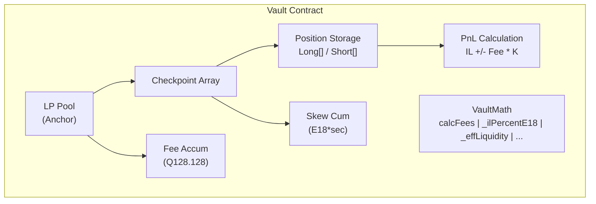
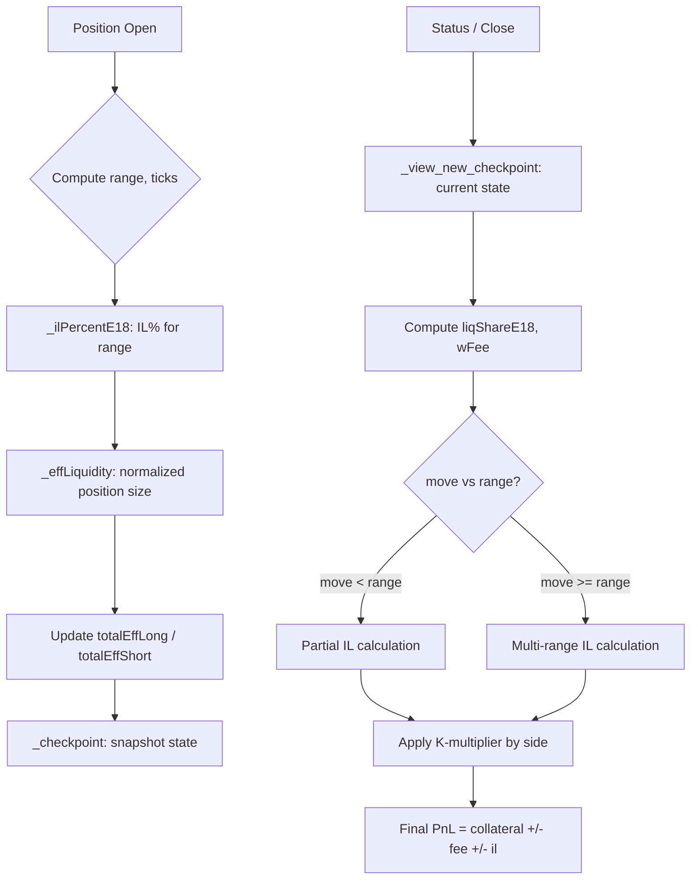
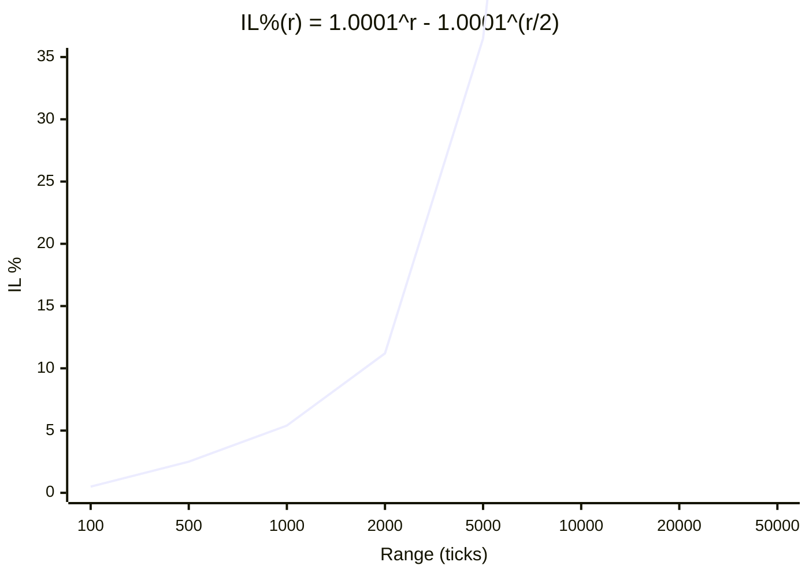
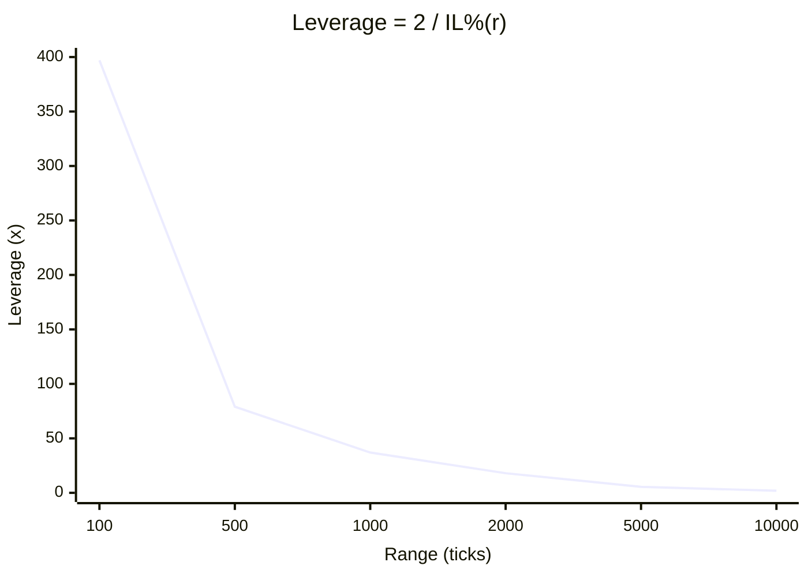
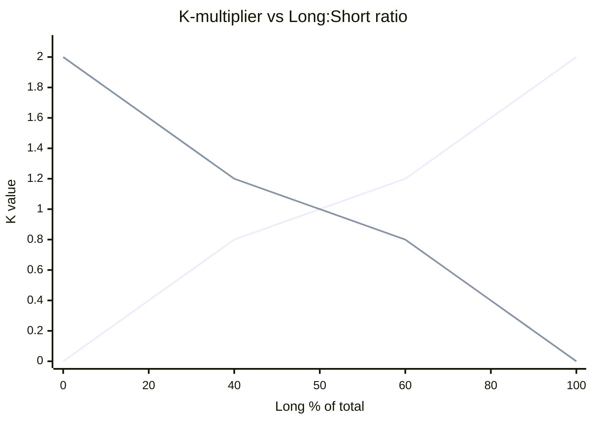
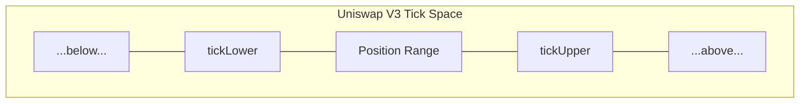
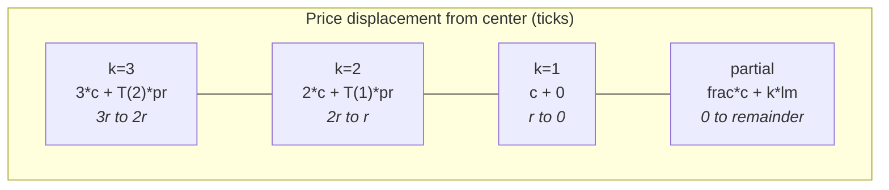

# Mathematical Specification

This document derives the mathematical formulas used in the sLiq Protocol and maps each
formula to its corresponding Solidity implementation. All notation uses LaTeX-style
formatting for readability. Every formula is verified against `VaultMath.sol` and `Vault.sol`.

---

## Mathematical Origins

The formulas in this document fall into two categories:

**Standard / derived from existing work:**
- The **Impermanent Loss formula** (Section 1) is derived from the standard Uniswap V3 concentrated liquidity mechanics described in the [Uniswap V3 Whitepaper](https://uniswap.org/whitepaper-v3.pdf) (Adams et al., 2021). The IL formula for concentrated positions is well-established in academic literature, including Echenim, Gobet & Maurice, ["Uniswap v3: impermanent loss modeling and swap fees asymptotic analysis"](https://hal.science/hal-04214315) (2023) and Deng, Zong & Wang, ["Static Replication of Impermanent Loss for Concentrated Liquidity Provision"](https://arxiv.org/abs/2205.12043) (2023).
- **Price conversion utilities** (Section 7) use standard Uniswap V3 tick math (`1.0001^tick` encoding, `sqrtPriceX96` format) as defined in the Uniswap V3 core contracts.
- **Vault share accounting** (Section 10) follows the ERC-4626 tokenized vault standard.

**Original to sLiq Protocol:**
- The **K-multiplier / skew mechanism** (Section 4) — a self-balancing fee distribution model where the K-factor dynamically adjusts based on the ratio of long vs. short effective liquidity. This creates a natural incentive gradient without external hedging or governance intervention.
- **Effective liquidity** (Section 2) — normalization of position size using the triangular number formula applied to tick ranges, producing a leverage-adjusted measure of exposure.
- **Fee distribution model** (Section 5) — checkpoint-based cumulative fee accounting with time-weighted skew integration, enabling accurate PnL for positions opened at arbitrary times.
- **Liquidation conditions** (Section 11) — asymmetric liquidation triggers for long (range exit) vs. short (fee accumulation exceeds collateral) positions.

---

## Table of Contents

1. [Impermanent Loss Formula](#1-impermanent-loss-formula)
2. [Effective Liquidity](#2-effective-liquidity)
3. [Leverage from Range Width](#3-leverage-from-range-width)
4. [Skew / K-Multiplier](#4-skew--k-multiplier)
5. [Fee Distribution](#5-fee-distribution)
6. [Position PnL Calculation](#6-position-pnl-calculation)
7. [Price Conversion Utilities](#7-price-conversion-utilities)
8. [Triangular Number](#8-triangular-number)
9. [Tick Difference Percentage](#9-tick-difference-percentage)
10. [Vault Share Accounting](#10-vault-share-accounting)
11. [Liquidation Conditions](#11-liquidation-conditions)
12. [Function-to-Math Reference Table](#12-function-to-math-reference-table)
13. [Precision and Rounding Analysis](#13-precision-and-rounding-analysis)

---

## System Overview



### Calculation Flow



---

## 1. Impermanent Loss Formula

### Background

In Uniswap V3 concentrated liquidity, a position with tick range
$[\text{tickLower},\, \text{tickUpper}]$ experiences impermanent loss when the price
moves away from the initial price. The IL depends on the width of the range and the
magnitude of the price move.

### Derivation

In Uniswap V3, price at tick $t$ is:

$$P(t) = 1.0001^{\,t}$$

For a symmetric position centered at the current tick with half-range $r$ ticks, the
maximum IL percentage occurs when the price moves to the edge of the range. Using the
concentrated liquidity IL formula:

$$\text{IL\%}(r) = P(r) - \sqrt{P(r)}$$

where:
- $P(r) = 1.0001^r$ is the price ratio at the range boundary
- $\sqrt{P(r)} = 1.0001^{r/2}$ is the geometric mean factor

**Step-by-step derivation:**

1. A concentrated liquidity position holds two tokens whose ratio shifts as price moves.
2. At the range boundary, the position is 100% in one token. The value relative to
   holding equals $\frac{2\sqrt{P}}{1 + P}$ for a full-range position, but in
   concentrated liquidity the loss per unit of notional simplifies to $P - \sqrt{P}$.
3. This represents the fraction of position value lost to IL when price moves $r$ ticks
   from the center of the range.

### IL Curve Visualization



### Implementation

**Function**: `VaultMath._ilPercentE18(int24 range)` (line 168)

```solidity
function _ilPercentE18(int24 range) public pure returns (uint256 ilE18) {
    if (range == 0) return 0;

    uint256 absTicks = uint256(int256(range > 0 ? range : -range));
    // 1.0001 in 1e18 fixed-point: 1_000_100_000_000_000_000
    uint256 pE18 = FPM.rpow(1000100000000000000, absTicks, 1e18);
    uint256 gE18 = FPM.sqrt(pE18 * 1e18);
    ilE18 = pE18 - gE18;
}
```

**Mapping to math:**

| Symbol | Solidity | Value |
|--------|----------|-------|
| $1.0001$ | `1000100000000000000` | $1.0001 \times 10^{18}$ |
| $1.0001^r$ | `pE18` | `FPM.rpow(1.0001e18, absTicks, 1e18)` |
| $\sqrt{1.0001^r}$ | `gE18` | `FPM.sqrt(pE18 * 1e18)` |
| $\text{IL\%}$ | `ilE18` | `pE18 - gE18` |

Note on the square root: `FPM.sqrt` expects input without scaling, but since `pE18` is
already in 1e18, multiplying by 1e18 before taking the square root yields
$\sqrt{P \times 10^{18}} \times \sqrt{10^{18}} = \sqrt{P} \times 10^{18}$,
which is $\sqrt{P}$ in 1e18 format. More precisely:
$\text{gE18} = \lfloor\sqrt{\text{pE18} \times 10^{18}}\rfloor$.

### Numerical Examples

| Range $r$ (ticks) | $1.0001^r$ | $\sqrt{1.0001^r}$ | IL% | `ilE18` |
|---|---|---|---|---|
| 100 | 1.01005 | 1.00501 | 0.504% | 5_040_000_000_000_000 |
| 1,000 | 1.10517 | 1.05127 | 5.390% | 53_900_000_000_000_000 |
| 5,000 | 1.64872 | 1.28403 | 36.47% | 364_700_000_000_000_000 |
| 10,000 | 2.71828 | 1.64872 | 106.96% | 1_069_600_000_000_000_000 |

(Values above 100% reflect the fixed-point math for very wide ranges; in practice,
positions use ranges where IL% << 100%.)

### Boundary Conditions

| Condition | Behavior | Code |
|-----------|----------|------|
| `range == 0` | Returns 0 (no price movement possible) | `if (range == 0) return 0;` |
| `range < 0` | Uses absolute value | `range > 0 ? range : -range` |
| Very large range | `pE18` grows exponentially; may overflow in `pE18 * 1e18` for `sqrt` | No explicit guard -- caller must use sane ranges |

---

## 2. Effective Liquidity

### Purpose

Effective liquidity normalizes position sizes across different ranges so that the skew
mechanism can compare Long and Short positions fairly. A position with a narrow range and
small collateral may have the same "market impact" as a position with a wide range and
large collateral.

### Formula

$$\text{eff}(c, r, r_a) = \frac{2c \cdot r_a}{r \cdot \text{IL\%}(r)}$$

where:
- $c$ = collateral amount (in token0 units)
- $r$ = half the tick range of the position
- $r_a$ = half the tick range of the anchor
- $\text{IL\%}(r)$ = impermanent loss percentage from Section 1

**Intuition:** The factor $\frac{2c}{\text{IL\%}(r)}$ is the notional position size (the
leveraged exposure). Multiplying by $\frac{r_a}{r}$ normalizes to the anchor's scale, so
positions with different ranges contribute proportionally to the skew.

### Derivation

```
  leverage = 2 / IL%(r)             ... from Section 3
  notional = leverage * c = 2c / IL%(r)
  eff      = notional * (r_a / r)   ... normalize to anchor scale
           = 2c * r_a / (r * IL%(r))
```

### Implementation

**Function**: `VaultMath._effLiquidity(uint256 collateral, int24 range, int24 anchorRange)`
(line 183)

```solidity
function _effLiquidity(
    uint256 collateral, int24 range, int24 anchorRange
) public pure returns (uint256 eff) {
    uint256 ilE18 = _ilPercentE18(range);
    eff = FullMath.mulDiv(
        2 * collateral,
        uint256(int256(anchorRange)) * 1e18,
        uint256(int256(range)) * ilE18
    );
}
```

**Fixed-point arithmetic:**

$$\text{eff} = \text{mulDiv}\!\left(2c,\; r_a \times 10^{18},\; r \times \text{ilE18}\right)$$

The $10^{18}$ in the numerator cancels with the $10^{18}$ scaling of `ilE18` in the
denominator, yielding `eff` in collateral-token units.

### Numerical Example

Given: $c = 1000\text{ USDC}$, $r = 500$ ticks, $r_a = 2000$ ticks

1. $\text{IL\%}(500) = 1.0001^{500} - 1.0001^{250} \approx 0.02530$ (2.53%)
2. $\text{eff} = \frac{2 \times 1000 \times 2000}{500 \times 0.02530} \approx 316{,}206$ USDC

### Boundary Conditions

| Condition | Behavior |
|-----------|----------|
| `range == 0` | `_ilPercentE18` returns 0; division by zero in `FullMath.mulDiv` would revert. Prevented by `ZeroRange` check in caller. |
| `collateral == 0` | Returns 0 (numerator is zero) |
| Very narrow range | Very large `eff` (high leverage dominates) |
| Very wide range | Small `eff` (low leverage, large denominator) |

---

## 3. Leverage from Range Width

### Derivation

Leverage is the ratio of notional exposure to collateral. Since a position's maximum loss
equals `collateral` and occurs when IL reaches $\text{IL\%}(r)$ of half the notional:

$$c = \text{notional} \times \frac{\text{IL\%}(r)}{2}$$

Therefore:

$$\text{leverage} = \frac{\text{notional}}{c} = \frac{2}{\text{IL\%}(r)}$$

Narrower ranges produce larger $\text{IL\%}$ values per tick, but the total IL percentage
is sub-linear with range, so narrower ranges produce higher leverage overall.

### Leverage Curve



### Implementation

**Function**: `Vault._calc_new_position()` (line 278)

```solidity
uint256 ilE18 = vaultMath._ilPercentE18(range);
leverageE18 = FullMath.mulDiv(2 * 1e18, 1e18, ilE18);
```

This computes:

$$\text{leverageE18} = \frac{2 \times 10^{18} \times 10^{18}}{\text{ilE18}} = \frac{2 \times 10^{36}}{\text{ilE18}}$$

Since `ilE18` is IL% scaled by $10^{18}$, the result is leverage scaled by $10^{18}$.

### Examples

| Range (ticks) | IL% (approx) | Leverage | Leverage (rounded) |
|--------------|-------------|----------|---------------------|
| 100 | 0.504% | 396.8x | ~397x |
| 500 | 2.530% | 79.1x | ~79x |
| 1,000 | 5.390% | 37.1x | ~37x |
| 5,000 | 36.47% | 5.48x | ~5.5x |
| 10,000 | 106.96% | 1.87x | ~1.9x |

The `_estimate` function also computes the notional position size:

```solidity
position = FullMath.mulDiv(leverageE18, amount, 1e18);
// position = leverage * collateral
```

---

## 4. Skew / K-Multiplier

### Purpose

The K-multiplier adjusts fee and IL payoffs based on the balance between Long and Short
effective liquidity. It replaces delta hedging as the vault's risk management mechanism.
When one side dominates, K punishes the dominant side and rewards the minority side,
creating an incentive for balance.

### Instantaneous Skew

At any point in time, given total effective liquidity $E_L$ (Long) and $E_S$ (Short):

$$K_{\text{short}} = \frac{2 E_L}{E_L + E_S}$$

$$K_{\text{long}} = \frac{2 E_S}{E_L + E_S}$$

**Conservation property:** $K_{\text{short}} + K_{\text{long}} = 2$ always holds.

When the sides are balanced ($E_L = E_S$), both K values equal 1.0.

### Skew Behavior Diagram



K_long rewards minority longs (increases as longs are underrepresented). K_short rewards minority shorts (increases as shorts are underrepresented). At balance (50:50), both equal 1.0.

### Fee-Deducted K (Instantaneous)

Both K values are further scaled by the fee deduction factor when used instantaneously:

$$K_{\text{effective}} = K \times \frac{10000 - f_v - f_p}{10000}$$

where $f_v$ = `feeVaultPercentE2` (default 300 = 3%) and $f_p$ = `feeProtocolPercentE2`
(default 200 = 2%).

With default fees (3% + 2% = 500 basis points), the scale factor is 0.95, so a perfectly
balanced K = $1.0 \times 0.95 = 0.95$.

### Implementation (Instantaneous)

**Function**: `Vault._calcSkewE18(uint256 num, uint256 den)` (line 269)

```solidity
function _calcSkewE18(uint256 num, uint256 den) internal view returns (uint256) {
    if (num == 0 || den == 0) return 0;
    return FullMath.mulDiv(
        FullMath.mulDiv(num, 1e18, den),
        (10_000 - uint256(feeVaultPercentE2) - uint256(feeProtocolPercentE2)),
        10_000
    );
}
```

Called as:
- Short K: `_calcSkewE18(2 * totalEffLong, totalEffLong + totalEffShort)`
- Long K:  `_calcSkewE18(2 * totalEffShort, totalEffLong + totalEffShort)`

### Time-Weighted Skew

Because positions can be open for extended periods during which the skew changes, the
protocol uses time-weighted averaging. Each checkpoint records cumulative skew-time
products using the **raw** (non-fee-deducted) K values:

$$\text{skewShortCum}[i] = \text{skewShortCum}[i\!-\!1] + K_{\text{short,raw}} \times \Delta t$$

$$\text{skewLongCum}[i] = \text{skewLongCum}[i\!-\!1] + K_{\text{long,raw}} \times \Delta t$$

where:

$$K_{\text{short,raw}} = \frac{2 E_L}{E_L + E_S} \qquad K_{\text{long,raw}} = \frac{2 E_S}{E_L + E_S}$$

The fee deduction is applied **later** when computing the effective K for a position:

$$K_{\text{eff}} = \frac{(\text{skewCum}[b] - \text{skewCum}[a]) \times (10000 - f_v - f_p)}{10000 \times (t_b - t_a)}$$

where $a$ = open checkpoint index, $b$ = close checkpoint index.

### Implementation (Time-Weighted)

**Function**: `Vault._view_new_checkpoint()` (line 390)

```solidity
// Raw skew (no fee deduction) stored in cumulative accumulators
uint256 skewShortE18 = (lastEffLong + lastEffShort) == 0
    ? 0
    : FullMath.mulDiv(2 * lastEffLong, 1e18, lastEffLong + lastEffShort);
uint256 skewLongE18 = (lastEffLong + lastEffShort) == 0
    ? 0
    : FullMath.mulDiv(2 * lastEffShort, 1e18, lastEffLong + lastEffShort);
uint256 skewShortW = totalTime * skewShortE18;
uint256 skewLongW = totalTime * skewLongE18;
uint256 skewShortCum = from.skewShortCum + skewShortW;
uint256 skewLongCum = from.skewLongCum + skewLongW;
```

**Function**: `Vault._statusCalc()` (line 416), applied to position PnL:

```solidity
// For Short positions -- time-weighted with fee deduction:
uint256 skewShortE18 = totalTime == 0
    ? _calcSkewE18(2 * totalEffLong, totalEffLong + totalEffShort)
    : FullMath.mulDiv(
        (to.skewShortCum - from.skewShortCum),
        (10_000 - uint256(feeVaultPercentE2) - uint256(feeProtocolPercentE2)),
        10_000 * totalTime
    );
```

The `totalTime == 0` fallback uses the instantaneous (already fee-deducted) `_calcSkewE18`
for positions opened and queried within the same block.

### Checkpoint Timing Diagram

```mermaid
gantt
    title K_short (raw, unscaled) over time
    dateFormat X
    axisFormat %s
    section K=1.0
        t0 to t1 (K=1.0)   : 0, 10
    section K=1.5
        t1 to t2 (K=1.5)   : 10, 30
    section K=1.0
        t2 to t3 (K=1.0)   : 30, 35
    section K=0.5
        t3 to t4 (K=0.5)   : 35, 60
```



`skewShortCum` accumulates the area under the K curve:
- `skewCum[t2] = skewCum[t1] + 1.5e18 * (t2 - t1)`
- `skewCum[t3] = skewCum[t2] + 1.0e18 * (t3 - t2)`

Position opened at t1, closed at t4:
`K_eff = (skewCum[t4] - skewCum[t1]) * 9500 / (10000 * (t4 - t1))`

### Boundary Conditions

| Condition | Behavior | Code |
|-----------|----------|------|
| No positions open ($E_L + E_S = 0$) | Returns 0 | `if (num == 0 \|\| den == 0) return 0` |
| Only Longs ($E_S = 0$) | $K_{\text{long}} = 0$, $K_{\text{short}} = 2$ | Shorts get 2x IL reward; Longs get 0 fees |
| Only Shorts ($E_L = 0$) | $K_{\text{short}} = 0$, $K_{\text{long}} = 2$ | Longs get 2x fees; Shorts get 0 IL reward |
| Perfectly balanced | $K = 1.0$ (0.95 after fee deduction) | Both sides get fair payouts |
| `totalTime == 0` | Uses instantaneous K | Same-block open+close fallback |

---

## 5. Fee Distribution

### Fee Collection

The anchor Uniswap V3 position accrues trading fees from swap activity. Fees are tracked
using Uniswap V3's fee growth accumulators in Q128.128 fixed-point format.

### Fee Growth Inside Calculation



**`feeGrowthGlobal`**: accumulated fees across ALL ticks.

| Case | Condition | Formula | Rationale |
|------|-----------|---------|-----------|
| 1 | `tickCurrent < tickLower` (price below range) | `fgInside = lower - upper` | Fees are "above" both ticks, cancel via subtraction |
| 2 | `tickCurrent >= tickUpper` (price above range) | `fgInside = upper - lower` | Fees are "below" both ticks |
| 3 | `tickLower <= tickCurrent < tickUpper` (price inside) | `fgInside = fgGlobal - lower - upper` | Subtract outside portions from global |

### Formula

For a position's fee entitlement:

$$\text{fgInside} = \begin{cases}
\text{lower} - \text{upper} & \text{if } \text{tick} < \text{tickLower} \\
\text{upper} - \text{lower} & \text{if } \text{tick} \geq \text{tickUpper} \\
\text{fgGlobal} - \text{lower} - \text{upper} & \text{otherwise}
\end{cases}$$

$$\Delta\text{fee} = \frac{(\text{fgInside}_{\text{now}} - \text{fgInside}_{\text{last}}) \times L}{2^{128}}$$

$$\text{totalFee} = \text{owed} + \Delta\text{fee}$$

where $L$ is the position's liquidity and `owed` is previously uncollected fees stored
in the NFT position manager.

### Token1-to-Token0 Conversion

Total fees are converted to a single denomination (token0):

$$\text{priceE18} = \frac{\text{sqrtPX96}^2 \times 10^{d_0 + 18 - d_1}}{2^{192}}$$

$$\text{token1InToken0} = \text{fromE18}\!\left(\text{token0},\; \frac{\text{toE18}(\text{token1}, \text{amount1}) \times 10^{18}}{\text{priceE18}}\right)$$

$$\text{totalFee}_{\text{token0}} = \text{fee0} + \text{token1InToken0}$$

### Implementation

**Function**: `VaultMath.calcFees()` (line 31)

```solidity
// Fee growth inside the position's range
if (tickCurrent < tickLower) {
    fg0Now = lower0 - upper0;
    fg1Now = lower1 - upper1;
} else if (tickCurrent >= tickUpper) {
    fg0Now = upper0 - lower0;
    fg1Now = upper1 - lower1;
} else {
    fg0Now = fg0G - lower0 - upper0;
    fg1Now = fg1G - lower1 - upper1;
}

// Delta fees = feeGrowthInside * liquidity / 2^128
uint256 add0 = FullMath.mulDiv(fg0Now - fg0Last, liquidity, 1 << 128);
uint256 add1 = FullMath.mulDiv(fg1Now - fg1Last, liquidity, 1 << 128);

fee0 = uint256(owed0) + add0;
fee1 = uint256(owed1) + add1;
```

### Per-Position Fee Share

Each position's share of total fees is proportional to its effective liquidity relative
to the anchor's total collateral value at the time of opening:

$$\text{liqShareE18} = \frac{\text{effLiquidity} \times 10^{18}}{\text{anchorCollateral}_{\text{open}}}$$

$$\text{wFee} = \frac{\Delta\text{totalFeeCum} \times \text{liqShareE18}}{1.3 \times 10^{18}}$$

The 1.3 divisor (stored as `13e17` in fixed-point) creates a conservative buffer, ensuring
the vault does not over-distribute fees. This means positions receive at most
$\frac{1}{1.3} \approx 76.9\%$ of their proportional fee entitlement.

### Implementation

**Function**: `Vault._statusCalc()` (line 416)

```solidity
uint256 liqShareE18 = FullMath.mulDiv(liqEff, 1e18, from.anchorCollateral);
uint256 totalFee = to.totalFeeCum - from.totalFeeCum;
uint256 wFee = FullMath.mulDiv(totalFee, liqShareE18, 13e17);
```

### Fee Application by Side

The K-multiplier is applied differently depending on the position side:

| Side | Fee | IL | Result |
|------|-----|----|--------|
| **Long** | `fee_credited = wFee * K_long` | `il_charged = ilCalc` (raw, no K) | `collateral + fee - il` |
| **Short** | `fee_charged = wFee` (raw, no K) | `il_credited = ilCalc * K_short` | `collateral - fee + il` |

- **Long positions**: Fees are income scaled by $K_{\text{long}}$. IL is charged at the
  raw (unscaled) rate. Longs profit when price moves (generating IL) less than the fees
  they earn.
- **Short positions**: Fees are a cost at the raw rate. IL income is scaled by
  $K_{\text{short}}$. Shorts profit when price moves significantly, generating IL that
  exceeds fees owed.

### Fee Splits on Close

When a position closes, protocol fees are extracted from the position's "income" side:

$$\text{feeProtocol} = \begin{cases}
\text{fee} \times \frac{f_p}{10000} & \text{if Long (income = fees earned)} \\
\text{il} \times \frac{f_p}{10000} & \text{if Short (income = IL earned)}
\end{cases}$$

### Implementation (Close)

**Function**: `Vault._close()` (line 530)

```solidity
uint256 feeProtocol = (p.side == Side.Long ? fee : il)
    * uint256(feeProtocolPercentE2) / 10_000;
```

### Numerical Example

Scenario: Long position, 1000 USDC collateral, range = 500 ticks, anchor range = 2000 ticks.

1. `effLiquidity` = 316,206 USDC (from Section 2)
2. `anchorCollateral` at open = 5,000,000 USDC
3. `liqShareE18` = 316,206 * 1e18 / 5,000,000 = 63,241,200,000,000 (6.32e13)
4. Suppose `totalFeeCum` delta = 50,000 USDC of fees accrued
5. `wFee` = 50,000 * 6.32e13 / 1.3e18 = 2.432 USDC (raw fee share)
6. With $K_{\text{long}} = 0.95$ (balanced): `fee` = 2.432 * 0.95 = 2.31 USDC

---

## 6. Position PnL Calculation

### Overview

```mermaid
flowchart TD
    S[Start: _statusCalc] --> T[Compute range, tickMid]
    T --> M[move = |currentTick - tickMid|]
    M --> SS{Side == Short?}
    SS -->|Yes| CAP[Cap move at range]
    SS -->|No| DIV
    CAP --> DIV[k = move / range, remainder = move mod range]
    DIV --> P{remainder > 0?}
    P -->|Yes| PARTIAL[Partial IL calculation]
    P -->|No| FULL
    PARTIAL --> FULL{move >= range?}
    FULL -->|Yes| MULTI[Multi-range IL: k*c + tri*perRange + k*lastMove]
    FULL -->|No| APPLY
    MULTI --> APPLY[Apply K-multiplier by side]
    APPLY --> RESULT[result = collateral +/- fee +/- il]
```

### IL Calculation for a Price Move

The IL for a position depends on how far the current price has moved from the position's
midpoint, relative to the position's range.

Define:
- $r$ = half the tick width of the position (`range`)
- $\text{tickMid}$ = midpoint tick ($\text{tickLower} + r$)
- $m$ = $|\text{currentTick} - \text{tickMid}|$ (absolute tick displacement)

### Case 1: Partial Move ($0 < m < r$)

For a partial price move of $m$ ticks within a range of $r$ ticks:

$$\sqrt{P_u} = 1.0001^{r/2}$$

$$\sqrt{P_t} = 1.0001^{m/2}$$

$$P_t = 1.0001^{m}$$

$$\text{avgPrice} = \sqrt{P_t}$$

The fraction of tokens that have been traded at the current displacement:

$$\text{tokenTrade} = 1 - \frac{\sqrt{P_u} - \sqrt{P_t}}{\sqrt{P_t} \cdot (\sqrt{P_u} - 1)}$$

The IL for this partial move:

$$\text{ilMovePercent} = \frac{\text{tokenTrade} \times (P_t - \text{avgPrice})}{2}$$

The notional position size and final IL:

$$\text{position} = \frac{2c}{\text{IL\%}(r)}$$

$$\text{ilCalc} = \text{position} \times \text{ilMovePercent}$$

#### Step-by-step derivation of tokenTrade

In concentrated liquidity, as price moves from the center toward the boundary, tokens
are progressively swapped. At displacement $m$ within range $r$:

```mermaid
xychart-beta
    title "Token composition as price moves through range"
    x-axis "Position in range" ["tickLower (m=r)", "", "", "tickMid (m=0)", "", "", "tickUpper (m=r)"]
    y-axis "% Token0" 0 --> 100
    line [100, 83, 67, 50, 33, 17, 0]
```

At displacement $m$ within range $r$, the `tokenTrade` fraction of tokens has been exchanged.

The remaining untraded fraction is $\frac{\sqrt{P_u} - \sqrt{P_t}}{\sqrt{P_t}(\sqrt{P_u} - 1)}$,
so the traded fraction is one minus that.

### Case 2: Full Range Exceeded ($m \geq r$)

When the price has moved through one or more complete ranges:

$$k = \lfloor m / r \rfloor \qquad \text{(number of full range crossings)}$$

$$\text{remainder} = m - k \cdot r \qquad \text{(partial ticks in the last range)}$$

The IL has three components:

$$\text{ilCalc} = \underbrace{k \cdot c}_{\text{boundary IL}} + \underbrace{T(k\!-\!1) \cdot \text{perRangeTerm}}_{\text{cumulative displacement}} + \underbrace{k \cdot \text{lastMoveTerm}}_{\text{partial range cost}}$$

where:

$$\text{perRangeTerm} = \frac{\text{tickDiffPercent}(r) \times c}{\text{IL\%}(r)}$$

$$\text{lastMoveTerm} = \frac{\text{tickDiffPercent}(\text{remainder}) \times c}{\text{IL\%}(r)}$$

$$\text{tickDiffPercent}(\delta) = 1.0001^{\delta} - 1$$

$$T(n) = \frac{n(n+1)}{2} \qquad \text{(triangular number)}$$

**Explanation of each term:**

1. **$k \cdot c$**: Each time the price crosses a full range boundary, the position loses
   one collateral unit worth of IL. After $k$ crossings, $k \cdot c$ of IL has accumulated.

2. **$T(k\!-\!1) \cdot \text{perRangeTerm}$**: Beyond the first range crossing, additional
   crossings incur increasing price displacement costs. The triangular sum accounts for
   the cumulative effect of each successive range being farther from the original position.

3. **$k \cdot \text{lastMoveTerm}$**: The partial move within the final (incomplete) range
   crossing contributes proportionally, multiplied by $k$ because the displacement from
   the origin amplifies the cost.

### Multi-Range IL Visualization



**Total IL** = `k*c + T(k-1)*perRangeTerm + k*lastMoveTerm + partialIL` (where `partialIL` comes from Case 1 for the remainder).

### Safe Short Rule

For Short positions, `move` is capped at `range`:

```solidity
if (move > range && p.side == Side.Short) move = range;
```

This means a Short can never lose more than its collateral to IL. The maximum IL for a
Short equals the collateral deposited (one full range crossing = $1 \times c$).

### K-Multiplier Application

After computing raw IL (`ilCalc`) and raw fees (`wFee`):

| Side | Fee | IL | Result |
|------|-----|----|--------|
| **Long** | $\text{fee} = \text{wFee} \times K_{\text{long}}$ | $\text{il} = \text{ilCalc}$ (raw) | $c + \text{fee} - \text{il}$ |
| **Short** | $\text{fee} = \text{wFee}$ (raw) | $\text{il} = \text{ilCalc} \times K_{\text{short}}$ | $c - \text{fee} + \text{il}$ |

### Implementation

**Function**: `Vault._statusCalc()` (line 416)

The full calculation spans lines 416-510. Key excerpts for each case:

```solidity
// --- Partial move IL (lastMoveI24 > 0) ---
uint256 sqrtPuE18 = FPM.rpow(1000100000000000000, uint256(int256(range/2)), 1e18);
uint256 sqrtPtE18 = FPM.rpow(1000100000000000000, uint256(int256(lastMoveI24/2)), 1e18);
uint256 PtE18 = FPM.rpow(1000100000000000000, uint256(int256(lastMoveI24)), 1e18);
uint256 avgPriceE18 = sqrtPtE18;
uint256 num = sqrtPuE18 - sqrtPtE18;
uint256 den = FullMath.mulDiv(sqrtPtE18, sqrtPuE18 - 1e18, 1e18);
uint256 tokenTradeE18 = 1e18 - FullMath.mulDiv(num, 1e18, den);
uint256 ilMovePercentE18 = FullMath.mulDiv(tokenTradeE18, PtE18 - avgPriceE18, 2e18);
uint256 ilE18 = vaultMath._ilPercentE18(range);
uint256 position = FullMath.mulDiv(2 * p.collateral, 1e18, ilE18);
ilCalc = FullMath.mulDiv(position, ilMovePercentE18, 1e18);

// --- Full range crossing IL (move >= range) ---
uint256 c = p.collateral;
uint256 perRangeTerm = FullMath.mulDiv(
    vaultMath.tickDiffPercentE18(range), c, ilAtRangeE18
);
uint256 lastMoveTerm = FullMath.mulDiv(
    vaultMath.tickDiffPercentE18(lastMoveI24), c, ilAtRangeE18
);
uint256 k = uint256(uint24(rangesInMove));
ilCalc += k * c;
if (k > 1) {
    ilCalc += FullMath.mulDiv(
        vaultMath.triangularNumber(k - 1), perRangeTerm, 1
    );
}
ilCalc += FullMath.mulDiv(k, lastMoveTerm, 1);

// --- Apply K by side ---
// Short: il is scaled by K_short; fee is raw
il = FullMath.mulDiv(ilCalc, skewShortE18, 1e18);
fee = wFee;

// Long: fee is scaled by K_long; il is raw
fee = FullMath.mulDiv(wFee, skewLongE18, 1e18);
il = ilCalc;

// --- Final PnL ---
// Long:  result = collateral + fee - il
// Short: result = collateral - fee + il
```

### Numerical Example: Partial Move

Scenario: Long, 1000 USDC collateral, range = 1000 ticks, price moved 400 ticks.

1. $\sqrt{P_u} = 1.0001^{500} = 1.05127$
2. $\sqrt{P_t} = 1.0001^{200} = 1.02020$
3. $P_t = 1.0001^{400} = 1.04081$
4. $\text{avgPrice} = \sqrt{P_t} = 1.02020$
5. $\text{num} = 1.05127 - 1.02020 = 0.03107$
6. $\text{den} = 1.02020 \times (1.05127 - 1) = 1.02020 \times 0.05127 = 0.05231$
7. $\text{tokenTrade} = 1 - \frac{0.03107}{0.05231} = 1 - 0.5940 = 0.4060$
8. $\text{ilMovePercent} = \frac{0.4060 \times (1.04081 - 1.02020)}{2} = \frac{0.4060 \times 0.02061}{2} = 0.004184$ (0.418%)
9. $\text{IL\%}(1000) = 0.05390$ (5.39%)
10. $\text{position} = \frac{2 \times 1000}{0.05390} = 37{,}106$ USDC
11. $\text{ilCalc} = 37{,}106 \times 0.004184 = 155.3$ USDC

The Long's result: $1000 + \text{fee} - 155.3$

---

## 7. Price Conversion Utilities

### sqrtPriceX96 to priceE18

Uniswap V3 stores prices as $\text{sqrtPX96} = \sqrt{P} \times 2^{96}$. To convert to a
human-readable price scaled to $10^{18}$:

$$\text{priceE18} = \frac{\text{sqrtPX96}^2 \times 10^{d_0 + 18 - d_1}}{2^{192}}$$

where $d_0$ and $d_1$ are the decimals of token0 and token1 respectively.

**Derivation:**

$$\text{sqrtPX96}^2 = P \times 2^{192}$$

$$P = \frac{\text{sqrtPX96}^2}{2^{192}}$$

To express in 1e18 with decimal adjustment:

$$\text{priceE18} = P \times 10^{18} \times \frac{10^{d_0}}{10^{d_1}} = \frac{\text{sqrtPX96}^2 \times 10^{d_0 + 18 - d_1}}{2^{192}}$$

**Function**: `VaultMath.sqrtpx96ToPriceE18()` (line 88)

```solidity
uint256 priceQ128x192 = uint256(sqrtPX96) * uint256(sqrtPX96);
uint256 scale = 10 ** (uint256(d0) + 18 - uint256(d1));
priceE18 = FullMath.mulDiv(priceQ128x192, scale, 1 << 192);
```

### tickToPriceE18

Converts a tick to a price by going through `sqrtPriceX96`:

$$\text{tick} \xrightarrow{\text{TickMath}} \text{sqrtPX96} \xrightarrow{\text{sqrtpx96ToPriceE18}} \text{priceE18}$$

**Function**: `VaultMath.tickToPriceE18()` (line 110)

```solidity
uint160 sqrtPX96 = TickMath.getSqrtRatioAtTick(tick);
priceE18 = sqrtpx96ToPriceE18(sqrtPX96, token0, token1);
```

### priceE18 to Tick

To convert from a 1e18 price back to a Uniswap V3 tick:

$$\text{ratioX192} = \frac{\text{priceE18} \times 2^{192}}{10^{18}}$$

Then adjust for decimal difference between tokens:

$$\text{ratioX192}_{\text{adj}} = \begin{cases}
\text{ratioX192} \times 10^{d_1 - d_0} & \text{if } d_1 > d_0 \\
\text{ratioX192} / 10^{d_0 - d_1} & \text{if } d_0 > d_1 \\
\text{ratioX192} & \text{if } d_0 = d_1
\end{cases}$$

$$\text{sqrtPX96} = \lfloor\sqrt{\text{ratioX192}_{\text{adj}}}\rfloor$$

$$\text{tick} = \text{getTickAtSqrtRatio}(\text{sqrtPX96})$$

**Function**: `VaultMath.priceE18ToTick()` (line 121)

```solidity
uint256 ratioX192 = FullMath.mulDiv(priceE18, uint256(1) << 192, 1e18);

if (d1 > d0) {
    uint256 scaleUp = FPM.rpow(10, uint256(d1 - d0), 1);
    ratioX192 = FullMath.mulDiv(ratioX192, scaleUp, 1);
} else if (d0 > d1) {
    uint256 scaleDown = FPM.rpow(10, uint256(d0 - d1), 1);
    ratioX192 = FullMath.mulDiv(ratioX192, 1, scaleDown);
}

uint256 sqrtU = FPM.sqrt(ratioX192);
if (sqrtU > type(uint160).max) revert SqrtOverflow();
tick = TickMath.getTickAtSqrtRatio(uint160(sqrtU));
```

### Token Value Summation

To express a combined token0 + token1 amount in token0 terms:

$$\text{tok1InTok0} = \text{fromE18}\!\left(\text{token0},\; \frac{\text{toE18}(\text{token1},\, \text{amount1}) \times 10^{18}}{\text{priceE18}}\right)$$

$$\text{total} = \text{amount0} + \text{tok1InTok0}$$

**Function**: `VaultMath.sumTok0Tok1In0()` (line 153)

```solidity
uint256 token1E18 = toE18(token1, token1Raw);
uint256 tok1InTok0E18 = FullMath.mulDiv(
    token1E18, 1e18, sqrtpx96ToPriceE18(sqrtPX96, token0, token1)
);
uint256 tok1InTok0 = fromE18(token0, tok1InTok0E18);
return token0Raw + tok1InTok0;
```

### Decimal Scaling Utilities

**`toE18(token, amt)`**: Converts token-native amount to 1e18:

$$\text{toE18} = \begin{cases}
\text{amt} \times 10^{18 - d} & \text{if } d < 18 \\
\text{amt} & \text{if } d = 18 \\
\text{amt} / 10^{d - 18} & \text{if } d > 18
\end{cases}$$

**`fromE18(token, wadAmt)`**: Converts 1e18 back to token-native:

$$\text{fromE18} = \begin{cases}
\text{wadAmt} / 10^{18 - d} & \text{if } d < 18 \\
\text{wadAmt} & \text{if } d = 18 \\
\text{wadAmt} \times 10^{d - 18} & \text{if } d > 18
\end{cases}$$

### Boundary Conditions

| Condition | Behavior | Code |
|-----------|----------|------|
| `priceE18 == 0` | Reverts with `ZeroPrice()` | `priceE18ToTick` line 122 |
| `sqrtU > type(uint160).max` | Reverts with `SqrtOverflow()` | `priceE18ToTick` line 141 |
| `d0 + 18 < d1` | Underflow in scale exponent | Would revert; practically impossible with standard ERC20 tokens |
| `sqrtPX96 == 0` | `priceE18 = 0` (division result) | Caller must validate |

---

## 8. Triangular Number

Used in the multi-range IL calculation (Section 6, Case 2) for cumulative displacement
costs:

$$T(n) = \frac{n(n+1)}{2} = \sum_{i=1}^{n} i$$

```mermaid
xychart-beta
    title "T(n) = n(n+1)/2"
    x-axis "n" [1, 2, 3, 4, 5, 6, 7, 8]
    y-axis "T(n)" 0 --> 40
    line [1, 3, 6, 10, 15, 21, 28, 36]
```

**Function**: `VaultMath.triangularNumber()` (line 211)

```solidity
function triangularNumber(uint256 n) public pure returns (uint256) {
    return FullMath.mulDiv(n, n + 1, 2);
}
```

Uses `FullMath.mulDiv` to avoid intermediate overflow on large $n$ values, since
$n \times (n+1)$ could exceed $2^{256}$ for very large $n$.

---

## 9. Tick Difference Percentage

Converts a tick delta to a percentage price change:

$$\text{tickDiffPercent}(\delta) = 1.0001^{\delta} - 1$$

This represents how much the price changes over $\delta$ ticks, as a fraction. For small
$\delta$, this is approximately $\delta \times 0.01\%$.

**Function**: `VaultMath.tickDiffPercentE18()` (line 192)

```solidity
function tickDiffPercentE18(int24 dt) public pure returns (uint256 percentE18) {
    uint256 p = FPM.rpow(1000100000000000000, uint256(int256(dt)), 1e18);
    percentE18 = (p - 1e18);
}
```

### Examples

| $\delta$ (ticks) | $1.0001^{\delta}$ | tickDiffPercent | Approx % |
|---|---|---|---|
| 1 | 1.0001 | 0.0001e18 | 0.01% |
| 100 | 1.01005 | 0.01005e18 | 1.005% |
| 1,000 | 1.10517 | 0.10517e18 | 10.517% |
| 10,000 | 2.71828 | 1.71828e18 | 171.8% |

### Boundary Conditions

| Condition | Behavior |
|-----------|----------|
| `dt == 0` | `rpow(..., 0, ...)` returns 1e18; `percentE18 = 0` |
| `dt < 0` | Cast to `uint256(int256(dt))` wraps to a huge number; caller must ensure non-negative |

---

## 10. Vault Share Accounting

The vault uses an ERC-4626-like share mechanism for LP deposits and withdrawals.

### Deposit

$$\text{shares} = \begin{cases}
\text{amount} & \text{if totalSupply} = 0 \text{ and unfrozen} = 0 \\
\max\!\left(\frac{\text{amount} \times \text{totalSupply}}{\text{unfrozen}},\; \text{amount}\right) & \text{otherwise}
\end{cases}$$

where $\text{unfrozen} = \text{balance} - \text{freezBalance}$ (vault balance minus
collateral locked in active positions).

The $\max(\ldots, \text{amount})$ guard prevents share dilution: if the vault has
accumulated losses and `unfrozen < totalSupply`, new depositors receive at least 1:1
shares.

**Function**: `Vault.deposit()` (line 636)

```solidity
uint256 assetsBefore = _totalAssets() - freezBalance;
if (totalSupply() == 0 && assetsBefore <= 0) {
    shares = amount;                                  // first depositor: 1:1
} else {
    shares = FullMath.mulDiv(amount, totalSupply(), assetsBefore);
    if (shares < amount) shares = amount;             // floor guard
}
_mint(msg.sender, shares);
```

### Withdraw

$$\text{amount} = \frac{\text{shares} \times \text{unfrozen}}{\text{totalSupply}}$$

Reverts if `unfrozen < totalSupply` (insufficient liquidity for withdrawals).

**Function**: `Vault.withdraw()` (line 655)

```solidity
uint256 unfreezeAssets = _totalAssets() - freezBalance;
if (unfreezeAssets < totalSupply()) revert InsufficientLiquidity();
amount = (shares * unfreezeAssets) / totalSupply();
_burn(msg.sender, shares);
```

---

## 11. Liquidation Conditions

A position can be liquidated when any of these conditions hold:

| Condition | Meaning |
|-----------|---------|
| $\text{currentTick} \leq \text{tickLower}$ | Price fell below position range |
| $\text{currentTick} \geq \text{tickUpper}$ | Price rose above position range |
| Short AND $\text{fee} \geq \text{collateral}$ | Short's accumulated fee cost exceeds its collateral |

**Function**: `Vault.liquidate()` (line 605)

```solidity
int24 tickNow = currentTick();
(uint256 collateral, uint256 _fee,,,) = _statusCalc(id);
uint256 liquidateR = 0;
if (p.side == Side.Short) {
    liquidateR = collateral;
}
if (!(tickNow <= p.tickLower || tickNow >= p.tickUpper
      || (liquidateR > 0 && _fee >= liquidateR))) {
    revert NotLiquidatable();
}
```

The liquidator receives a fixed bounty of `bountyLiquidatorE18` (default: `15e12`).

### Rolling Positions

On liquidation, positions with a `Rolling` mode can automatically re-open:

| Mode | Behavior |
|------|----------|
| `No` | Position closes permanently |
| `Direct` | Reopens with same side and same parameters |
| `InverseMinus` | Flips side if result < collateral (lost money) |
| `InversePlus` | Flips side if result > collateral (made money) |

Rolling only triggers if the position owner has sufficient balance and allowance for
a new collateral transfer.

---

## 12. Function-to-Math Reference Table

| VaultMath Function | Line | Mathematical Formula | Section |
|---|---|---|---|
| `calcFees()` | 31 | $\Delta\text{fee} = (\text{fgInside}_{\text{now}} - \text{fgInside}_{\text{last}}) \times L / 2^{128}$ | 5 |
| `toE18()` | 69 | $\text{amt} \times 10^{18-d}$ | 7 |
| `fromE18()` | 78 | $\text{wadAmt} / 10^{18-d}$ | 7 |
| `sqrtpx96ToPriceE18()` | 88 | $\text{sqrtPX96}^2 \times 10^{d_0+18-d_1} / 2^{192}$ | 7 |
| `tickToPriceE18()` | 110 | tick -> sqrtPX96 -> priceE18 | 7 |
| `priceE18ToTick()` | 121 | $\text{priceE18} \times 2^{192}/10^{18}$ -> sqrt -> tick | 7 |
| `sumTok0Tok1In0()` | 153 | $\text{amount0} + \text{fromE18}(\text{toE18}(\text{amount1}) / \text{price})$ | 7 |
| `_ilPercentE18()` | 168 | $1.0001^r - \sqrt{1.0001^r}$ | 1 |
| `_effLiquidity()` | 183 | $2c \cdot r_a / (r \cdot \text{IL\%}(r))$ | 2 |
| `tickDiffPercentE18()` | 192 | $1.0001^{\delta} - 1$ | 9 |
| `triangularNumber()` | 211 | $n(n+1)/2$ | 8 |

| Vault Function | Line | Mathematical Formula | Section |
|---|---|---|---|
| `_calcSkewE18()` | 269 | $(2E_{\text{opp}} / (E_L+E_S)) \times (10000-f_v-f_p)/10000$ | 4 |
| `_calc_new_position()` | 278 | leverage $= 2 \times 10^{36} / \text{ilE18}$ | 3 |
| `_view_new_checkpoint()` | 390 | Cumulative skew: $\text{cum}_{i} = \text{cum}_{i-1} + K_{\text{raw}} \times \Delta t$ | 4 |
| `_statusCalc()` | 416 | Full PnL: IL (partial/multi-range) + fees + K-multiplier | 6 |
| `deposit()` | 636 | $\text{shares} = \text{amount} \times \text{supply} / \text{unfrozen}$ | 10 |
| `withdraw()` | 655 | $\text{amount} = \text{shares} \times \text{unfrozen} / \text{supply}$ | 10 |

---

## 13. Precision and Rounding Analysis

### Fixed-Point Representations

| Format | Precision | Used For | Range |
|--------|-----------|----------|-------|
| 1e18 (wad) | 18 decimal places | Prices, percentages, K-values, leverage | 0 to ~$1.16 \times 10^{59}$ |
| Q128.128 | 128 fractional bits | Uniswap fee growth accumulators | Full uint256 with wrap-around |
| Q64.96 | 96 fractional bits | sqrtPriceX96 | 0 to $2^{160} - 1$ |
| Basis points (E2) | 2 decimal places | Fee percentages | 0 to 10000 |

### Rounding Direction Summary

All rounding in the protocol favors the vault (rounds against the position holder):

| Operation | Method | Rounding | Effect |
|-----------|--------|----------|--------|
| `FullMath.mulDiv(a, b, c)` | $(a \times b) / c$ | Truncates (floor) | Fees and IL round down |
| `FPM.sqrt(x)` | $\lfloor\sqrt{x}\rfloor$ | Floor | IL% slightly underestimated (conservative) |
| `FPM.rpow(b, e, s)` | Binary exponentiation | Accumulated truncation | Small cumulative undercount |
| Integer division `a / b` | Solidity default | Truncates | Shares, amounts round down |

### Key Precision Properties

**1. `FullMath.mulDiv` prevents overflow:**

This function from Uniswap V3 computes $(a \times b) / c$ using 512-bit intermediate
multiplication, avoiding overflow that would occur with naive `(a * b) / c` when
$a \times b > 2^{256}$. Every multiplication-then-division in the protocol uses this.

**2. `FPM.rpow` binary exponentiation:**

Computes $\text{base}^{\text{exp}}$ in 1e18 fixed-point using repeated squaring. Each
squaring step introduces a truncation error of at most 1 unit in the last place (ulp)
of the 1e18 representation. For an exponent requiring $\log_2(n)$ squarings, the
cumulative error is bounded by $\log_2(n)$ ulps, which is negligible for practical
tick ranges (< 50 ulps for $n < 10^{15}$).

**3. Square root precision in `_ilPercentE18`:**

The expression `FPM.sqrt(pE18 * 1e18)` first multiplies two 1e18-scaled values, producing
a value up to ~$10^{36}$ (well within uint256). The floor square root introduces at most
1 ulp of error in the $10^{18}$ domain. Since this appears in a subtraction (`pE18 - gE18`),
the relative error in IL% is:

$$\frac{\text{error}_{\sqrt{}}}{P - \sqrt{P}} \leq \frac{1}{(P - \sqrt{P}) \times 10^{18}}$$

For practical ranges (100-50000 ticks), this relative error is negligible ($< 10^{-15}$).

**4. Cumulative skew precision:**

Skew accumulators store $K \times \Delta t \times 10^{18}$ as uint256. For a maximum
block time of ~12 seconds and K values up to $2 \times 10^{18}$, each checkpoint adds
at most $24 \times 10^{18}$. This allows approximately $10^{58}$ checkpoints before
overflow, which is practically infinite.

**5. Fee growth wrap-around safety:**

Uniswap V3 fee growth accumulators use unsigned integer arithmetic where overflow (wrap)
is intentional. The subtraction `fg0Now - fg0Last` yields the correct delta even if
`fg0Now` has wrapped past `fg0Last`, due to unsigned integer underflow semantics in
Solidity 0.8 with `unchecked` blocks in the Uniswap library. The sLiq protocol relies
on this property for correct fee accounting.

**6. The 1.3x fee buffer:**

The divisor `13e17` in fee distribution creates an intentional underpayment of ~23%:

$$\text{utilization} = \frac{1}{1.3} \approx 0.769$$

This safety margin ensures the vault never distributes more fees than it actually holds,
accounting for rounding accumulation across many positions and checkpoints. The unused
portion remains in the vault, benefiting LP share holders.

### Potential Precision Concerns

| Concern | Impact | Mitigation |
|---------|--------|------------|
| Very narrow ranges (< 10 ticks) | IL% is tiny; leverage is huge; `eff` may overflow | Caller should enforce minimum range |
| Very old positions (years) | Cumulative skew grows large; multiplication in `_statusCalc` could approach overflow | uint256 headroom is vast ($>10^{58}$ seconds) |
| Tokens with 0 decimals | `toE18` multiplies by $10^{18}$; large amounts could overflow | Practical ERC20 amounts fit comfortably |
| `pE18 * 1e18` in `_ilPercentE18` | For range > ~132,000 ticks, `pE18 > 10^{20}` and product exceeds uint256 | Ranges this wide are impractical; no guard needed |
| Integer division in `range/2` for odd ranges | Loses 0.5 ticks (half a basis point of price) | Negligible; Uniswap ticks are discrete integers |